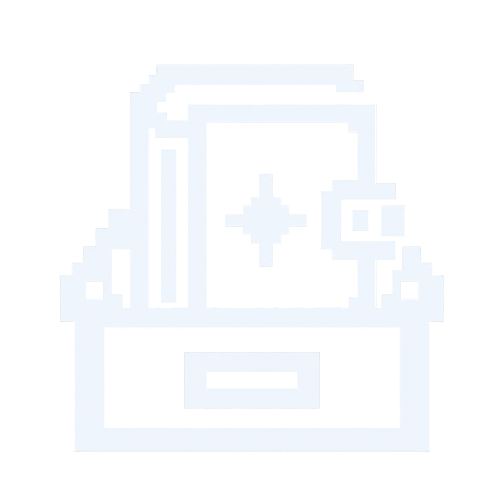

#  Archivist

Archivist is a lightweight archive manager for Omarchy. It follows your current theme and gives you a simple place to open, extract, and edit archives.

## What it does

- Opens archives and extracts everything or just the files you select.
- Creates and edits ZIP, 7z, TAR, TAR.GZ, TAR.BZ2, TAR.XZ, and TAR.ZST archives.
- Creates and edits RAR archives when the `rar` command is installed. Readable RAR archives can still be opened and extracted without it.
- Shows progress, speed, and time remaining during extraction and most edits.

## Install

Download the latest Omarchy package from [Releases](https://github.com/seth-reee/archivist/releases), then install it from your Downloads folder:

```bash
sudo pacman -U ./archivist-*.pkg.tar.zst
```

The package recipe supports Omarchy on x86_64 and ARM64, using Arch Linux and Arch Linux ARM respectively. Install the package whose filename matches your machine's architecture. To build from the tagged release, install `base-devel`, `cmake`, `ninja`, `qt6-base`, `libarchive`, and `pkgconf`, then run `makepkg -s` in `packaging/`.

**ARM64 status:** The ARM64 package built and launched headlessly under QEMU, but remains untested on a real ARM64 Omarchy desktop.

Open **Archivist** from the application menu.

## Use

Choose **New archive** to pick a name, location, format, and compression level. You can add files right away or start with an empty archive. Choose **Open** to browse an existing archive, then use **Extract** or the edit buttons in the toolbar.

Archivist skips unsafe archive paths and does not overwrite existing extracted files. Password protected and split archives are not supported yet.

## Build from source

Requires CMake, Qt 6 Widgets, and libarchive.

```bash
cmake -S . -B build
cmake --build build
./build/archivist
```

## License

Archivist is made by [seth-reee](https://github.com/seth-reee) and is available under the [MIT License](LICENSE).
